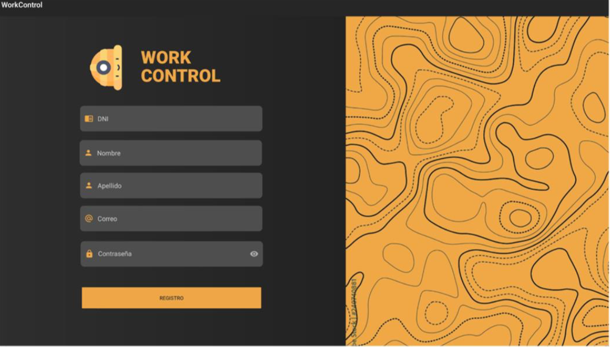
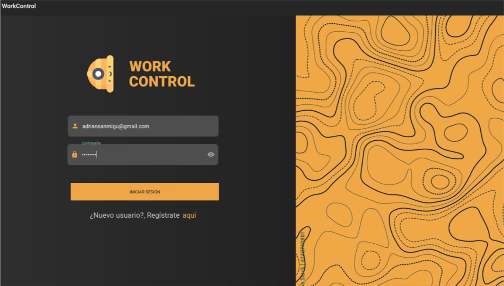
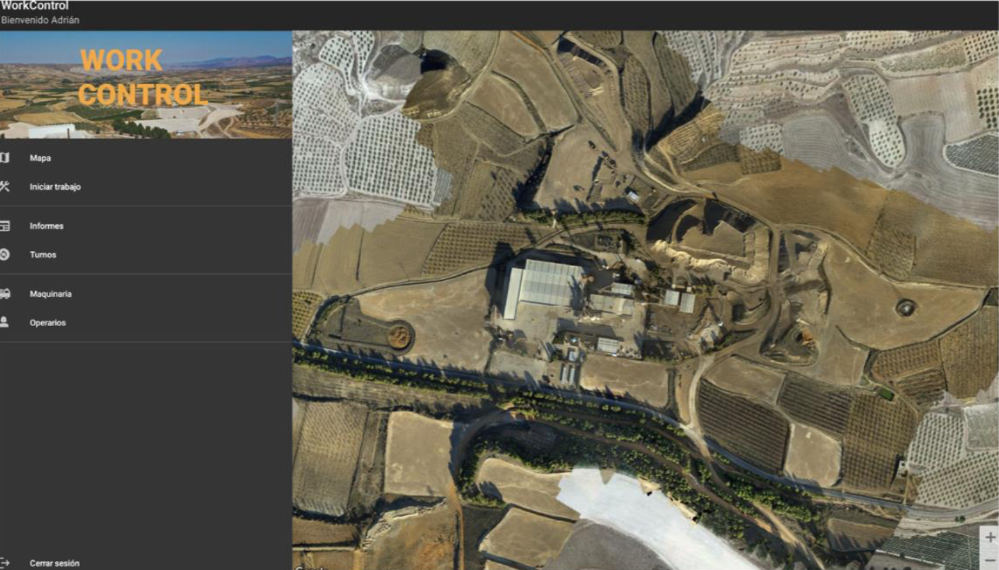
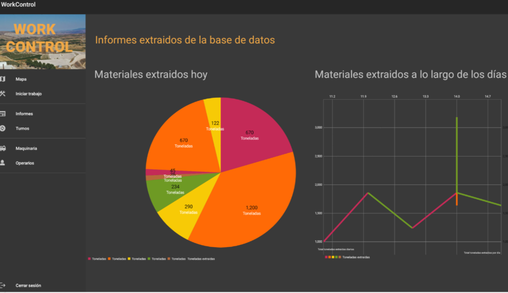
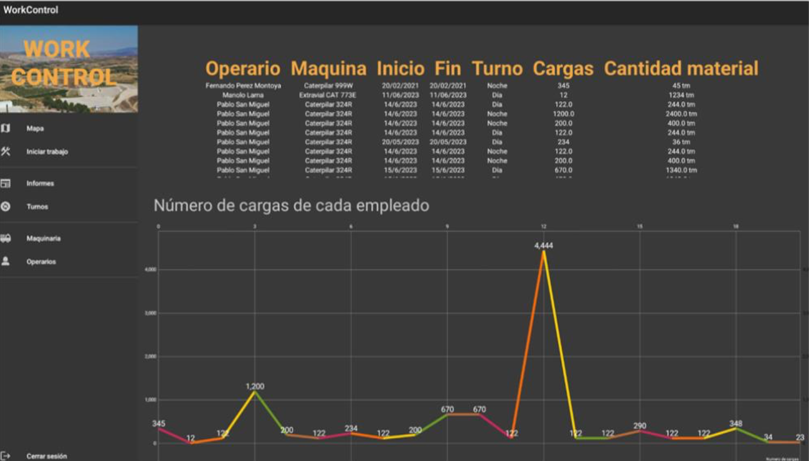
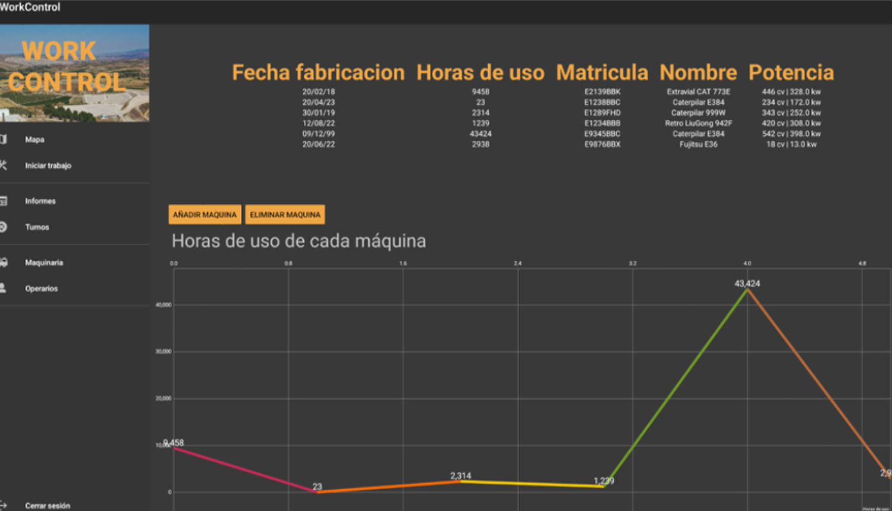
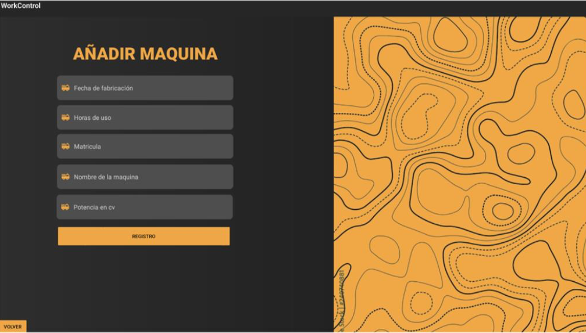
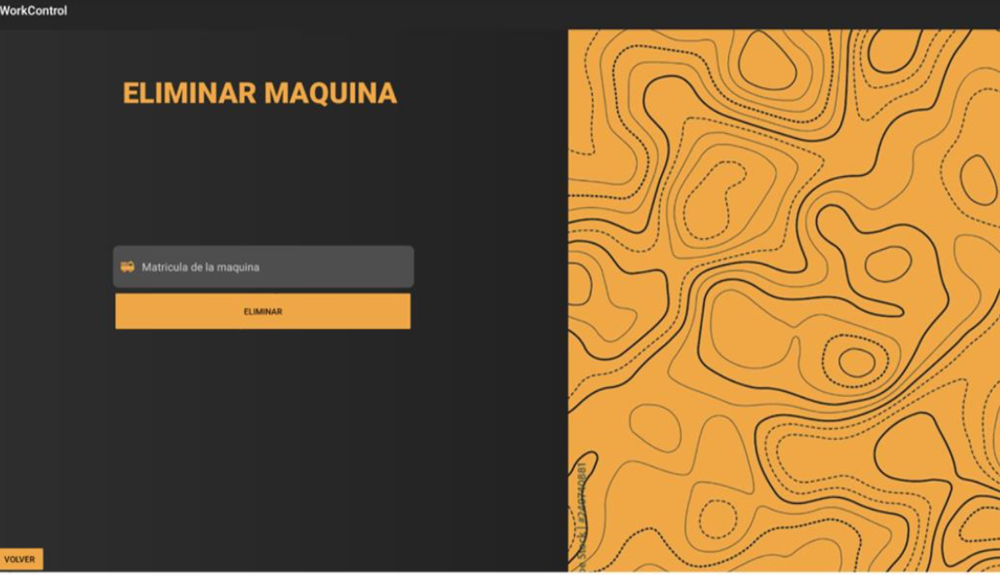

Manual de usuario de la aplicación

La aplicación WorkControl es una aplicación destinada al control de diferentes trabajadores, tras iniciarla, se nos abrirá un panel para iniciar sesión.

[^1]: Figura 1. (Pantalla de inicio de sesión)

En esta pantalla, podremos introducir nuestros datos para iniciar sesión, para iniciar la sesión introduciremos los datos en los campos de texto y le daremos al botón de iniciar sesión.

Usuario con permisos de administrador:

- Usuario: adriansanmigu@gmail.com
- Contraseña: adrian02

Usuario con permisos de operario:

- Usuario: pablosanmigu@gmail.com
- Contraseña: pablosm02

En caso de que seamos un nuevo usuario y no dispongamos de ninguna cuenta, tendremos que crearla, la aplicación dispone de un menú para la creación de cuentas, para ello, haremos clic sobre texto que pone “aquí”, cuando presionemos sobre ese campo, se iniciará la pantalla de creación de usuarios.

[^1]:Figura 2. (Pantalla de creación de cuentas)

Una vez dentro, podremos ver la pantalla, esta contiene los datos necesarios a introducir para crear un usuario nuevo. A continuación, rellenamos los datos y hacemos clic sobre el botón “registro”.

[^1]:Figura 3. (Pantalla de creación de usuario con los datos introducidos)

Una vez introducidos los datos, hacemos clic sobre el botón “registrar”.
Tras registrar el usuario volveremos a la pantalla de login.

Ahora, vamos a iniciar sesión, dado que la gestión de permisos de los usuarios se realiza de manera externa a la aplicación, no podemos asignar permiso de administrador a la cuenta que hemos creado desde la aplicación, pero, ya que disponemos de una cuenta qué si que tiene permisos de administrador, vamos a iniciar sesión con ella.

Para iniciar sesión con una cuenta, introducimos los datos en los campos correspondientes y hacemos clic en el botón “iniciar sesión”.

[^1]:Figura 4. (Pantalla de inicio de sesión con los datos introducidos)

A continuación, hacemos clic en iniciar sesión, si los datos del usuario son correctos, nos redirigirá a una de las siguientes pantallas dependiendo de los permisos del usuario, en el caso de que el usuario sea administrador, se redirigirá a la pantalla de administrador, en caso contrario, se redirigirá a la pantalla de operario.

Una vez iniciada la sesión con un usuario administrador, veremos la siguiente pantalla.
En esta pantalla podremos ver toda la información a cerca de los operarios, de las máquinas, de los turnos e informes de todos ellos.

[^1]:Figura 5. (Pantalla de inicio de administrador)

Disponemos de un menú para poder movernos entre todas estas opciones, la primera opción del
menú llamada “mapa”, nos redirigiría a esta misma pantalla, en la que podemos ver el menú en grande y un mapa de la zona en la que se ubican los operarios.

Al hacer clic en los diferentes apartados del menú podemos cargar las pantallas referenciadas a los mismos.

En este caso, vamos a hacer clic en “informes”, para ver los informes de los operarios.

Esta es la pantalla de informes, en la misma, podemos ver dos gráficos, el primer gráfico, (el gráfico circular), indica la cantidad de material de material que ha extraído por turno en toneladas.

El siguiente gráfico, indica el total de material que han extraído los operarios por día.

[^1]:Figura 6. (Pantalla de informes)

A continuación, vamos a hacer clic en el siguiente panel del menú, en “turnos”.

En esta pantalla, podemos ver una tabla con los datos de los turnos de los operarios ya realizados y un gráfico que muestra el número de cargas que ha realizado cada operario a lo largo del tiempo.

[^1]:Figura 7. (Pantalla de turnos)

A continuación, al hacer clic en el menú sobre la opción de “maquinaria”, cargamos la pantalla de
maquinaria, en esta pantalla podemos ver información a cerca de las diferentes máquinas activas de la empresa, en esta pantalla también podemos añadir y dar de baja nuevas máquinas.

[^1]:Figura 8. (Pantalla de maquinaria)

Vamos a suponer que queremos dar de alta una nueva máquina, para ello, hacemos clic sobre el botón naranja llamado “añadir máquina”

[^1]:Figura 9. (Pantalla de añadir máquina)

Una vez introducidos los datos, hacemos clic sobre el botón llamado “registro”, una vez hecho el clic, se habrá registrado la nueva máquina correctamente.

A continuación, vamos a dar de baja esta nueva máquina que hemos creado, para ello, tras dar de alta la nueva máquina habremos sido redirigidos a la pantalla de maquinaria, en ella, hacemos clic sobre el botón llamado “eliminar máquina”, se abrirá la pantalla de eliminar máquina.

[^1]:Figura 10. (Pantalla de eliminar máquina)